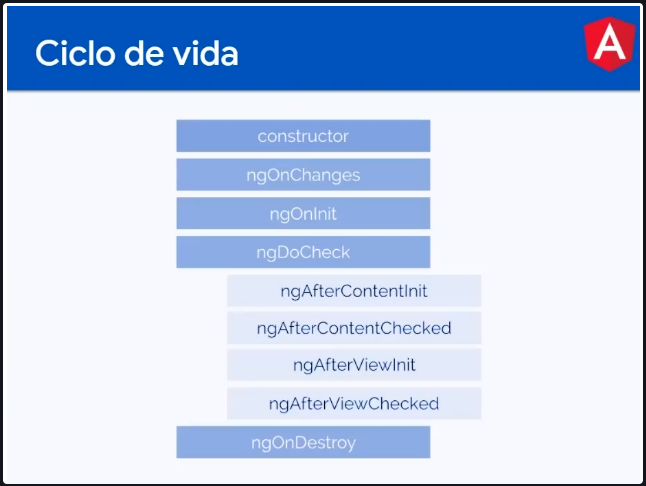

# Componentes

Son porciones del proyecto que son reutilizables y solicitados bajo demanda.


Cómo crearlos: 

```
ng g c <directorio/nombreComponente>
```
Un componente sólo puede pertenecer a un módulo

## Partes de un componente

El archivo con la extensión .ts es el componente principal de cualquier Angular.
```
import { Component } from '@angular/core';

@Component({
  selector: 'app-test-name',
  templateUrl: './test-name.component.html',
  styleUrls: ['./test-name.component.scss']
})
export class TestNameComponent {
    ...
}

```
Observa lo más importante, el decorador @Component().

Los decoradores alteran el comportamiento de una clase en Angular, para que el compilador de TypeScript interprete el código de la manera correcta y sepa que una clase es:

* Un componente.
* Un módulo.
* Un servicio.
* Una directiva, etc.

Este decorador es quién enlaza el componente con el archivo HTML y la hoja de estilos, además le otorga al componente un selector o un nombre para utilizarlo en tus templates.

# Inputs

Para comunicar componentes, Angular hace uso de decoradores para intercambiar información entre un componente padre hacia un componente hijo y viceversa.

Comunicando componentes
Para enviar información de padre a hijo, puedes utilizar el decorador @Input() para marcar una propiedad de una clase como punto de entrada de un dato.

```
<p style=‘text-align:center;’>

</p>
```
```
import { Component, Input } from '@angular/core';

@Component({
  selector: 'app-test-name',
  templateUrl: './test-name.component.html',
  styleUrls: ['./test-name.component.less']
})
export class TestNameComponent {

  @Input() firstname: string;

  constructor() { }
}
```
Debes importar Input desde @angular/core para poder utilizar esta directiva e indicar que la propiedad firstname es un dato que el componente padre enviará.

Podrás inicializar el componente desde su padre y pasarle los inputs que este necesite de la siguiente manera:
```
<app-test-name>
    firstname="Platzi"
</app-test-name>
```
También puedes cambiar el nombre el Input especificando el nombre de la propiedad que quieras que este utilice al inicializar el componente.

```
@Input('my-name') firstname: string;
```

    <app-test-name>
        my-name="Platzi"
    </app-test-name>

## Data binding en Inputs

El decorador @Input() detectará cualquier cambio en el dato y automáticamente actualizará su valor. Si ocurre algún evento en el componente padre que cambie el valor en el Input firstname, el componente hijo recibirá inmediatamente ese nuevo valor.

Input Set
Otra manera de utilizar la directiva @Input es de la siguiente manera:

    @Input() set saludar(firstname: string) {
        console.log('Hola', firstname)
    };

Observa que en esta oportunidad, cada vez que se envía un valor al @Input, se ejecutará la función saludar() que recibe como parámetro el valor que se le haya enviado.

De esta manera, puedes ejecutar la lógica que necesites dentro de esta función cada vez que el valor del @Inputcambia.

# Outputs

Así como el decorador @Input permite el envío de información desde un componente padre hacia un componente hijo, el uso de @Outputs permite lo contrario.

## Comunicación hijo a padre
A partir de la emisión de un evento, el decorador @Output() permite enviar mensajes desde un componente hijo hacia el padre.


## Envío del mensaje
Para esto, se hace uso de la clase EventEmitter importándola desde @angular/core, para crear en tu componente una propiedad emisora de eventos.

import { Component, Output, EventEmitter } from '@angular/core';

    @Component({
      selector: 'app-test-name',
      templateUrl: './test-name.component.html',
      styleUrls: ['./test-name.component.less']
    })
    export class TestNameComponent {

      @Output() message = new EventEmitter<string>();

      constructor() { }
    }
Decorando la propiedad con el @Output() y creando una instancia de EventEmitter podrás emitir un evento de la siguiente manera:

    ...
    emitirEvento() {
        this.message.emit('Hola soy Platzi');
    }
Llamando al método emit() de la instancia EventEmitter, se enviará el valor al componente padre que se encuentre escuchando el evento.

Recepción del mensaje
Desde el componente padre, inicializa el componente hijo de la siguiente manera:

    <app-test-name>
        (message)="recibirMensaje($event)"
    </app-test-name>

Se “bindea” la propiedad emisora de eventos con () y se le pasa una función que se ejecutará cada vez que emita un evento.
Y en el componente padre:

    import { Component } from '@angular/core';

    @Component({
      selector: 'app-father',
      templateUrl: './father.component.html',
      styleUrls: ['./father.component.less']
    })
    export class FatherComponent {

      constructor() { }
      
      recibirMensaje(event: Event) {
        console.log(event);
      }
    }

La función recibirMensaje() posee un parámetro del tipo Event que contendrá el mensaje del componente hijo.

# Ciclo de vida componentes

Un componente pasa por varias etapas en su ciclo de vida. A través de hooks, puedes realizar una determinada acción cuando el componente es inicializado, cuando se dispara un evento, cuando se detecta un cambio, cuando el componente es destruido, etc.

A continuación, se detalla la secuencia de eventos y el orden de los mismos:



## Hooks más utilizados
### Constructor
Como en toda clase en la programación orientada a objetos, el constructor es quien crea la instancia del objeto y sus dependencias.

* Solo se ejecuta una vez antes del render del componente.
* No tiene que utilizarse para procesos asincrónicos.

### ngOnChanges

El hook ngOnChanges() se dispara cada vez que se produce un cambio de estado en el componente. Cuando una variable cambia de valor, por ejemplo o ante el cambio de valor de un Input.

* Se ejecuta N cantidad de veces antes y durante el render del componente.
* Puede emplearse para procesos asincrónicos.

### ngOnInit
Es el hook más usado, ngOnInit() es ideal para cualquier solicitud de datos asincrónicos a una API para preparar el componente antes de renderizarlo.

* Únicamente se ejecuta una vez, antes del render del componente.
* Puede usarse para procesos asincrónicos.

### ngAfterViewInit
Este hook únicamente se ejecuta una vez cuando el render del componente haya finalizado. Puede serte útil para realizar acciones programáticas que requieran que todo el HTML del componente ya este preparado.

* Únicamente se ejecuta una vez después del render del componente.

### ngOnDestroy
Finalmente, ngOnDestroy() se ejecutará cuando el componente es destruido, o sea, cuando ya no existe en la interfaz del navegador. Suele utilizarse para liberar espacios de memoria que el componente requiera.

Usando hook
Los hooks de ciclo de vida de Angular, son interfaces que tienen que importarse desde @angular/core para implementarlos en la clase y así detectar los cambios en cada evento.

    import { Component, OnInit, AfterContentInit, OnDestroy } from '@angular/core';

    @Component({
      selector: 'app-test-name',
      templateUrl: './test-name.component.html',
      styleUrls: ['./test-name.component.less']
    })
    export class TestNameComponent implements OnInit, AfterContentInit, OnDestroy {

      constructor() {
        console.log('1. Primero sucederá esto');
      }

      ngOnInit(): void {
        console.log('2. Luego esto');
      }
      
      ngAfterViewInit(): void {
        console.log('3. Seguido de esto');
      }
      
      ngOnDestroy(): void {
        console.log('4. Finalmente esto (cuando el componente sea destruido)');
      }
      
    }
Cada hook tiene sus características y utilidades recomendadas dependiendo lo que necesitas. Es importante seguir estas recomendaciones para buscar optimizar el rendimiento de tu aplicación.

